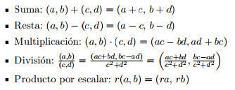

LPP_M_17
==============

Práctica de Laboratorio #4. Pruebas Unitarias
------------

- Sergio González Rodríguez [Coordinador]
- Romina Alejandra Martín Liberón [Colaborador]

Los números complejos son una extensión de los números reales y forman el mínimo cuerpo algebraicamente cerrado que los contiene. Todo número complejo puede representarse como la suma de un número real y un número imaginario (que es un múltiplo real de la unidad imaginaria que se indica con la letra i).

Se define un complejo z como un par ordenado de números reales (a, b) ó (Re(z), Im(z)). A la primera componente, que se ha denotado por a, se le llama parte real. A la segunda, denotada como b, parte imaginaria. Se denomina número imaginario puro a aquel que está compuesto sólo por la parte imaginaria, es decir, aquel en el que a = 0. Para los complejos se definen las siguientes operaciones:

